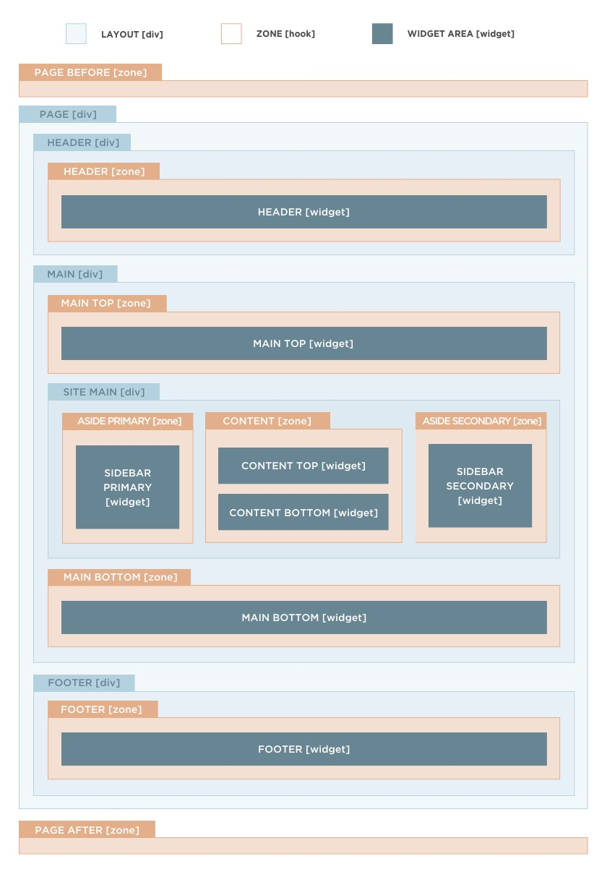
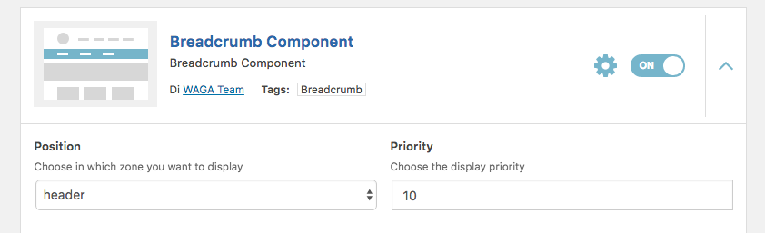
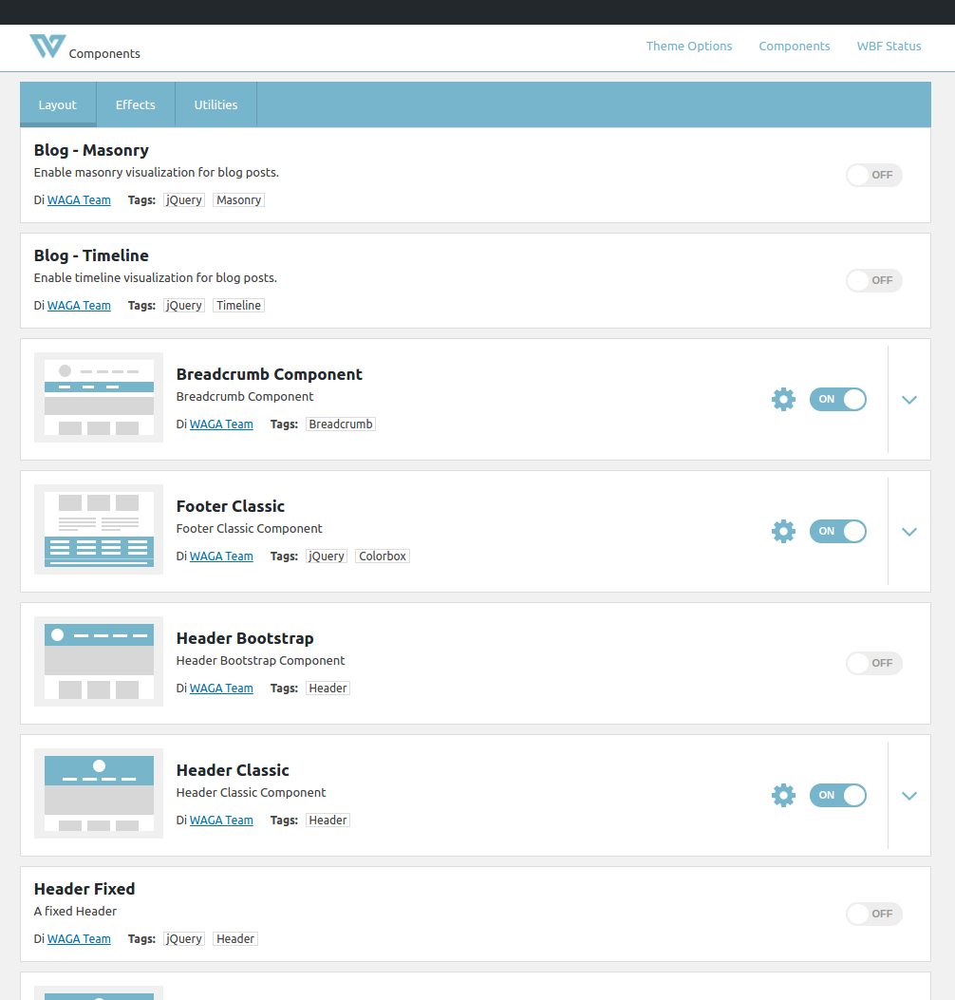
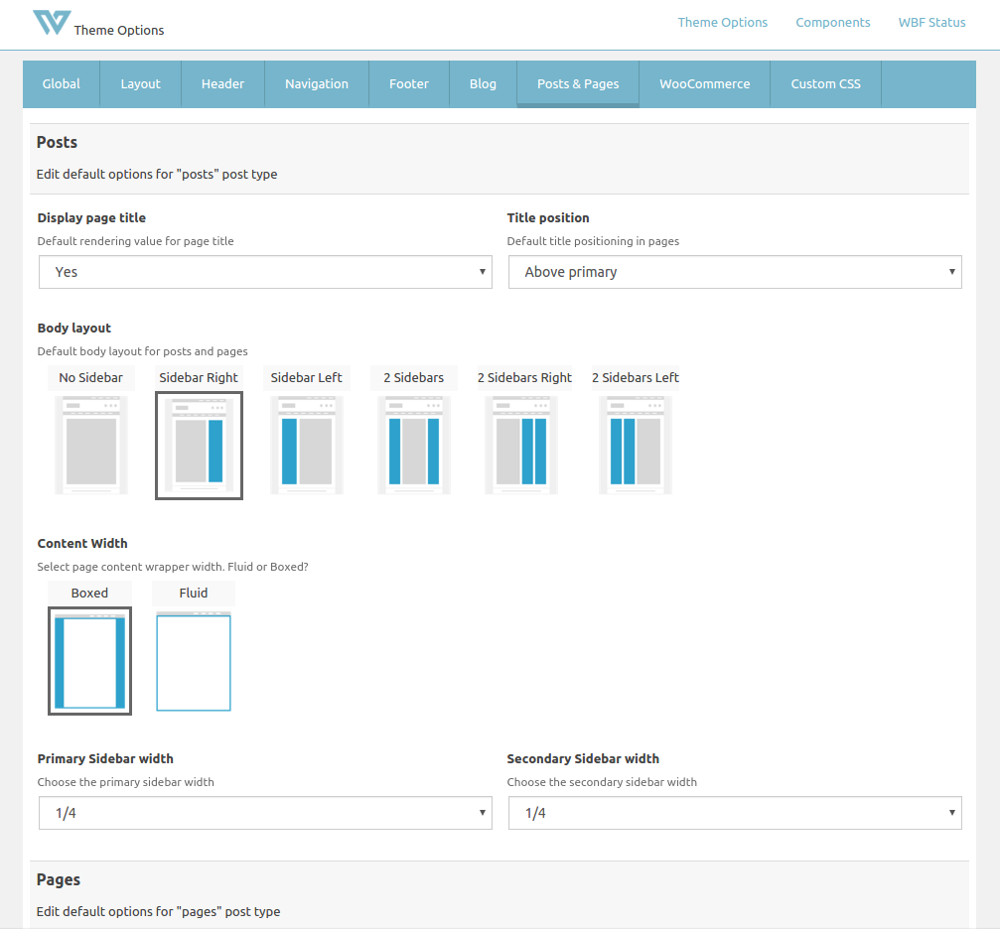
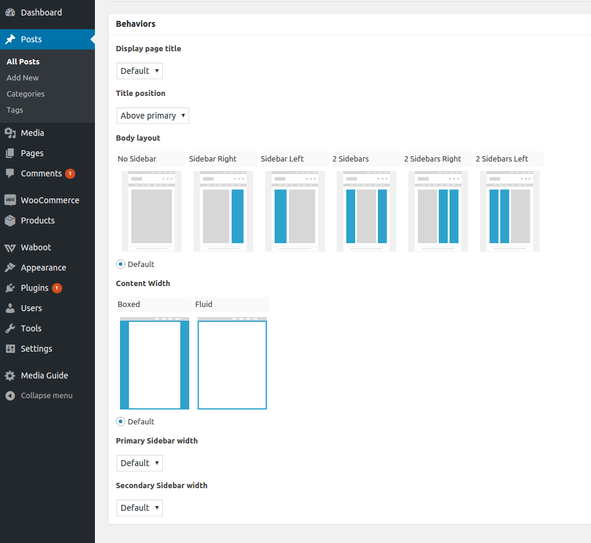

[Zones](#zones) | [Components](#components) | [Template system](#template-system) | [Theme Options](#theme-options) | [Generators](#generators) | [Roadmap](#roadmap)

# Waboot Theme

Waboot is a multipurpose Wordpress theme with focus on speed, usability and modularity; it is aimed mainly to professionals and web agencies.

It's component-based nature allows developers to use only the features they need and helps them to keep the code base organized and easy to maintain.

A sample theme child is provided within the package.

## Building

- `yarn` or `npm install`
- `composer install`
- `gulp setup` (requires Bower)

## Usage (as parent theme)

- Download the precompiled version [here](http://update.waboot.org/resource/get/theme/waboot).
- Copy `waboot-child` directory into `wp-content/` and rename it accordingly to your project.
- Follow the readme inside the child theme.
 
## Key concepts

Waboot is based on the concept of **zones** and is built through **components**. 

Components are self-contained micro-plugins that provide a specific feature (like: breadcrumbs, lazyloading, different types of headers and footers...).

Zones are layout partials that, by default, are rendered blank (or not rendered at all) unless some component is attached to them. 

Components hook to zones with a specific weight. Components with lower weight are rendered before components with higher weight.
 
You can move around components by edit their render zone and weight through WordPress dashboard.

Learn more about [zones](#zones) and [components](#components).

## No more template overriding

Waboot feature a redesigned template hierarchy system which goal is to keep template overriding at minimum.

Learn more about [here](#template-system).

# Zones

Waboot provide flexibility through **zones**. Zones are layout partials to which components and widget areas can attach.

Like in WordPress hook system, lower priority components\widget areas are rendered before higher ones.

## Predefined zones

Waboot ships with some predefined zones that can be visualized here:



**Widget areas** are attached to zones with a default weight of **50**.

## Zones and components

Components can be easily moved between zones through WordPress dashboard:



Here you can change the component position (zone) and priority (weight).

For example, in the case of the Breadcrumb component shown above, you can choose to move it from the header zone to the sidebar primary zone, and fine-tuning its position above or below other components or widget areas.

## Advanced topics on zones

Under the hood zones are just WordPress actions with standardized names. `\Waboot\Layout` provides a quick API to them.

### Create a new zone

Create a new zone is easy:

- Register the zone  

    ```php
    \WabootLayout()->create_zone(string <zone_name>, [\WBF\components\mvc\View|string|FALSE <zone_view>, array <zone_params>]);
    ```
    
    The only required param is the zone name. Zone name can be any `[a-z-]+` string. 
    
    The view (when provided) can be a [WBF View](https://github.com/wagaweb/wbf/tree/master/src/components/mvc) or a string. If a string is provided, the template will be retrieved via `locate_template()`.

- Render the zone

    To render a zone, you only need to call `\WabootLayout()->render_zone(<zone_name>);` where you want to render it.
    
    If a template is assigned to the zone, make sure you included `\WabootLayout()->do_zone_action(<zone_name>);` within the that template.

### Hook to a zone programmatically

When a zone is registered, Waboot prepares an action with a name like: "`waboot/zones/<zone_name>`". You can hook directly to this hook or use Layout API:

```php
\WabootLayout()->add_zone_action(<zone_name>,<call_back>);
```

**Beware:** due to the fact that in WordPress the child functions.php is loaded before the parent one, the `Waboot()` will not be available outside hooks. To work, the above line must be run during an hook, for example: `init`.

```php
//Example: include a template in a specific zone (main-bottom):
add_action("init",function(){
    \WabootLayout()->add_zone_action("main-bottom","append_foo_bar");
},14);

function append_foo_bar(){
    get_template_part('templates/foo','bar');
}
```

### Zones and widget areas

Waboot features an easy way to register new widgets areas, edit the default ones and attach them to zones.

The function [`Waboot\functions\get_widget_areas`](https://github.com/wagaweb/waboot/blob/master/inc/template-functions.php) is called during `widgets_init` by [`Waboot\hooks\widget_areas\register_widget_areas`](https://github.com/wagaweb/waboot/blob/master/inc/hooks/widget_areas.php).

You can edit or add new widgets area through `"waboot/widget_areas/available"` filter.

```php
add_filter("waboot/widget_areas/available", function($widget_areas){
    //Edit, add, remove widget areas from $widget_areas array
    return $widget_areas;
});
```

`$widget_areas` is an associative array where the keys are widget area slugs or id. Every widget area can have a set of params.

_Standard wordpress sidebar params_ (see, for example, `twentysixteen_widgets_init()` in twentysixteen theme):

- `name`: the widget area name (default to: the slug)
- `description`: the widget area description (default to empty string)
- `before_widget`: html to print before the widget area (default to: `<div id="%1$s" class="widget %2$s">`)
- `after_widget`: html to print after the widget area (default to: `</div>`)
- `before_title`: html to print before the name (default to: `<h3 class="widget-title">`)
- `after_title`: html to print after the name (default to: `</h3>`)

_Custom Waboot params_

- `render_zone`: the zone slug in which the widget area has to be rendered
- `type`: the widget area type (can be `simple` or `multiple`, default to: `simple`)  

    When type is `multiple`, Waboot creates a number of widget areas accordingly to `subareas` param.
    
    These widget areas are named, by default, as `"$name.' '.$index"` (eg: "footer 1", "footer 2", ect...).
    
    You can control where the index is inserted by putting an `{{ n }}` placeholder in `name` param.
    
    Area slug\id dictates which template is used to render the area: 
    
    - When type is `single` the widget area is rendered using: `templates/widget_areas/standard.php` view.
    
        If a file named `templates/widget_areas/{$area_id}.php` (eg: `templates/widget_areas/footer.php`) exists, then this file is used as template.
    
    - When type is `multiple` the widget area is rendered using: `templates/widget_areas/parts/multi-widget-area.php` view.
    
- `subareas`: the number of subareas when type is `multiple`.
- `render_priority`: A number which specify rendering priority for the area, a lower number means higher priority (Defaults to 50).

<span style="font-size:smaller"><a href="#waboot-theme">Back to top.</a></span>

# Components
<a name="#components"></a>

Waboot components leverage on [WBF Components](https://github.com/wagaweb/wbf/tree/master/src/modules/components) to provide a flexible, multi-purpose environment.

Waboot ships with a component repository full of components ready to be used; you can also develop your custom components or install third-party components.

Refer to WBF docs to learn how to develop custom components.

## Usage

You can manage components through dashboard.



For your convenience our components are categorized under three main categories: **Layout**, **Effects** and **Utilities**.

Each component has specific and layout-related settings. Specific settings (render zone, visibility, weight...) can be customized directly through components UI. 

[Theme Options](#theme-options) page aggregates and organize layout settings of active components.
 
<span style="font-size:smaller"><a href="#waboot-theme">Back to top.</a></span> 

# Template system

With Waboot, we revisited some features of the WordPress template system with the following goals:

- To stay as [DRY](https://en.wikipedia.org/wiki/Don%27t_repeat_yourself) as possible.
- To make as much agile as possible the practice of templates overriding in child themes.
- To adhere to a "Convention over configuration" principle.
 
In particular:

- The first entrance point is the `index.php` file. In classic WordPress this file is used as last resort solution.

    We did that in order to keep the template files in the root folder at minimum and to avoid the repeating of get_header\get_footer\get_sidebar and layout wrappers among multiple files.
    
    `index.php` acts as a router and includes the correct template partial based on current request.
    
    We achieved that by rendering here a [zone](#zones) called "content", which has (as primary default hook) a [function](https://github.com/wagaweb/waboot/blob/master/inc/hooks/zones_std_hooks.php) that respond to requests and includes the correct partial.
    
- Classic WordPress template files can be found under `templates/`.

    These templates are stripped of the usual header, footer and sidebar includes, which are handled by `index.php`.
        
- Archive templates can be easily customized in child themes without many `archive-$posttype.php` or `taxonomy-$taxonomy.php` files in root folder.

    Waboot [`archive.php`](https://github.com/wagaweb/waboot/blob/master/templates/archive.php) file automatically includes the right `archive-$posttype.php` or `taxonomy-$taxonomy.php` file under `templates/archive` folder.

- Author templates follows a similar logic: Waboot [`author.php`](https://github.com/wagaweb/waboot/blob/master/templates/author.php) file automatically includes the right `author-$nicename.php` or `taxonomy-$id.php` file under `templates/author` folder.
    
- Custom templates (those that are selectable from the dashboard) can be treated as partials as well.

    Waboot automatically recognizes any file called `content-[a-z]+` under `templates/parts-tpl` as custom template partial and make it selectable from the dashboard.
    
    Then, [`page.php`](https://github.com/wagaweb/waboot/blob/master/templates/page.php) automatically includes the partial you selected.
    
- We used [WBF Views](https://github.com/wagaweb/wbf/tree/master/src/components/mvc) wherever possible. WBF Views has some advantages over classic `get_template_part()` function.

    Views can be found under: `templates/view-parts`.    
    
<span style="font-size:smaller"><a href="#waboot-theme">Back to top.</a></span>

# Theme Options

Waboot features many predefined options that allow the customization of many aspects of the theme. Child themes can additional enrich them. 

Refers to [WBF Options module](https://github.com/wagaweb/wbf/tree/master/src/modules/options) to learn how to implement new options.

Of particular interest is the section denominated "**Posts and Pages**". In this section there are special kind of options called "**Behaviors**". 



**Behaviors are options that can be customized on post\page basis.** In "Posts and Pages" section you can set their default values relatively to the available post-types.

Later, when editing a specific post or page, you can change the default values specifically for that post, as shown below:
  


Refers to [WBF Behaviors module](https://github.com/wagaweb/wbf/tree/master/src/modules/behaviors) to learn more about behaviors and how to implement them.

<span style="font-size:smaller"><a href="#waboot-theme">Back to top.</a></span>

# Generators
<a name="#generators"></a>

Generators are a feature that allows developers to specify configurations in JSON files (_generators_), that can be later imported.

Generators are good to create different startup configurations for your child themes. In Waboot they are used to bootstrap different configurations of Components and Theme Options.

More informations and tutorials [here](https://github.com/wagaweb/waboot/tree/master/inc/generators).

# Roadmap

**v2.0.x**

:heavy_check_mark: Bugfix releases.

**v2.1.x**

- :heavy_check_mark: Generators introduction 

- :heavy_check_mark: Bugfix releases.

**v2.2.x**

- :heavy_check_mark: The "wordpress" template directory will be removed.

- :heavy_check_mark: Bugfix.

**v2.3.x**

- :heavy_check_mark: Exclusive support for WBF 1.1.0

- Bugfix

**v3.0.x**

- :heavy_check_mark: Deprecation of Bootstrap dependency

- :heavy_check_mark: Components repository

- Bugfix

**v3.1.x**

- Templates and logic refinements

- Bugfix

:tada: Official Waboot launch! :rocket:

**Future releases**

- Full support for customizer

- Implementation of tests

<span style="font-size:smaller"><a href="#waboot-theme">Back to top.</a></span>


